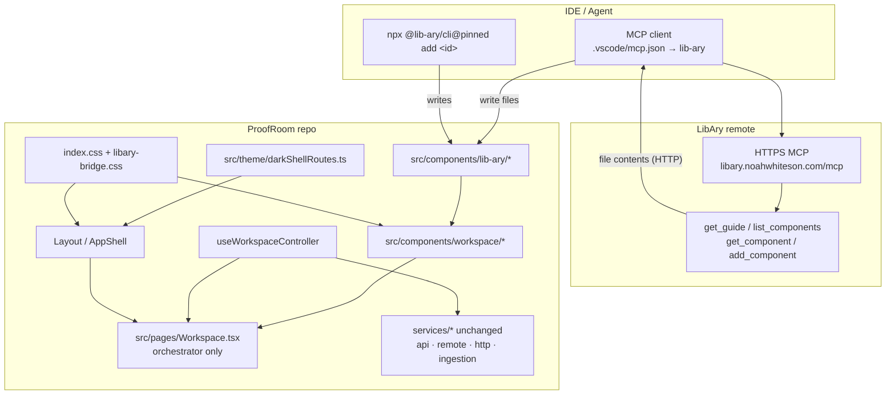
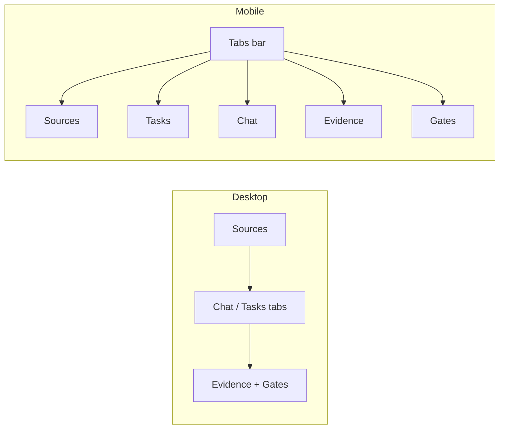
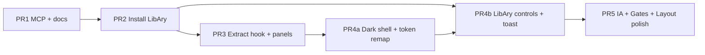

# ProofRoom Workspace Redesign: LibAry UI + MCP Wiring

| Field | Value |
|-------|--------|
| **Status** | Draft (rev 3 — slash-opacity theme fix) |
| **Author** | TBD |
| **Date** | 2026-08-07 |
| **Workspace** | `/home/codespace/.grok/worktrees/workspaces-proofroom/main` |
| **Related** | `src/pages/Workspace.tsx`, `src/components/Layout.tsx`, `src/index.css`, LibAry MCP |

---

## Overview

ProofRoom’s primary product surface—the Workspace—is a **749-line monolithic React page** (`src/pages/Workspace.tsx`) that packs document ingest/verify, gated AI tasks, citation chat, evidence seals, and local pipeline status into one grid of glass cards. The surrounding shell (`Layout.tsx`) and marketing pages use a **light paper/gold** design system (Cormorant Garamond + DM Sans, Tailwind v4 `@theme`). Due-diligence density and interaction quality have outgrown that single-file layout.

This design proposes:

1. **Wire LibAry via MCP** so agents and developers install editable UI primitives from `https://libary.noahwhiteson.com/mcp` (or the CLI).
2. **Decompose Workspace** into composable panels with a clearer information architecture (Sources · Tasks · Chat · Evidence · Gates).
3. **Bridge design systems** by adopting a **dark workspace shell** (LibAry-native) for authenticated app routes while **preserving paper/gold** for Home and public report microsites—via **(a) cascade remapping of solid `@theme` color variables** and **(b) explicit CSS overrides for slash-opacity utilities** (baked hex / dual-emitted rules—not cascade-only).
4. **Ship incrementally** through independently mergeable PRs (**PR-4a theme** then **PR-4b LibAry controls**) with no backend schema changes and **git-revert rollback** (no classic-UI feature flag).

LibAry is not an opaque npm package of runtime primitives: components are **copied into the repo** under `src/components/lib-ary/<id>/` as project-owned React + co-located CSS. Remote HTTP MCP returns file contents; the agent (or CLI/stdio MCP) must write them to disk.

---

## Background & Motivation

### Current state

| Area | Reality |
|------|---------|
| Workspace | Single file ~749 LOC; all state, dual-mode fetch, handlers, and UI inline |
| Layout | Sticky glass nav; room `<select>`; unlock / reset / API+LLM badge; wraps **all** routes including `/` and `/r/:roomId` |
| Styling | Tailwind v4 `@theme` paper/gold tokens in `src/index.css`; utility-first classes; `body` hardcodes paper bg/ink color |
| Data | Dual-mode: local `Store` (`localStorage`) vs remote (`VITE_API_URL` → Hono `:8787` + Postgres) |
| Components | Only `Layout.tsx`, `ReportPortal.tsx` under `src/components/` |
| Path alias | `@/*` → `src/*` already in `tsconfig.json` and `vite.config.ts` |
| MCP | No `.vscode/mcp.json` today |
| Tests | Essentially `src/utils/hash.test.ts` only; `scripts/e2e-smoke.sh` for stack smoke |
| Approvals pending filter | `runs.filter(r => r.status === 'pending')` in `Approvals.tsx` |

**Workspace regions today (top → bottom / left → right):**

1. Header (title, room badge, publish CTA, load errors)
2. Pipeline chips (local orchestration only; null in API mode)
3. Left column (~380px): Documents (upload/paste + expand/verify) · Evidence (run list + hash/receipt)
4. Right column: AI Tasks grid · Chat stream + input

### Pain points

- **Maintainability:** Business logic (ingest, verify, runTask, streamChat) is tightly coupled to presentation; hard to unit-test panels in isolation.
- **Density:** Large glass cards and generous padding waste horizontal space for DD workflows that need multi-pane scanning.
- **Hierarchy:** Sources, gates, chat, and evidence compete visually; gated tasks are only a badge, not a first-class “gates” surface.
- **Feedback:** Errors use inline rose text; no toast system for upload/verify/run outcomes.
- **Theme collision risk:** Dropping dark LibAry components onto paper surfaces will look broken unless tokens are bridged deliberately. Existing panels are saturated with `bg-paper`, `text-ink`, `glass-card`, etc.

### Why LibAry

- Agent-friendly install (`get_guide` → `list_components` → `get_component` → `add_component` / CLI).
- Editable source under the project (customizable for ProofRoom gold accents).
- Motion-forward controls that map cleanly to cards, tabs, modals, toasts, inputs, accordions.
- Stack match: React 19 + TypeScript (project already on React 19.2 / Vite 7).

---

## Goals & Non-Goals

### Goals

1. Create IDE MCP config for LibAry (`.vscode/mcp.json`) and document agent/CLI install workflow (VS Code vs Cursor config shapes).
2. Install a **v1 set** of LibAry components into `src/components/lib-ary/` and adopt them in Workspace (+ shell where appropriate).
3. Split `Workspace.tsx` into composable panels + a data hook with a **complete TypeScript contract**; preserve dual-mode API/local behavior with **byte-identical branch predicates**.
4. Improve IA: Sources / Tasks / Chat / Evidence / Gates with responsive multi-pane (desktop) and stacked/tabs (mobile).
5. Define a coherent light-vs-dark strategy with **solid token cascade remapping + explicit slash-opacity overrides**; document body/document theming; respect `prefers-reduced-motion` without nuking state transitions.
6. Incremental rollout so local demo and API modes keep working without backend changes; rollback via **git revert**, not a classic-UI flag.
7. Deliver an ordered, independently mergeable **PR plan** (theme shell separate from LibAry control swap).
8. Require controller unit tests in the extract PR and dual-mode QA checklists on every PR.

### Non-Goals

- Backend schema migrations, new API routes, or auth model changes.
- Full visual redesign of Home marketing, PublicReport microsite, or sealed PDF layout (keep paper/gold trust aesthetic).
- Deep LibAry panel redesign of Audit / Publish / Approvals in v1 (they get **dark chrome only**; cards/controls later).
- Replacing lucide-react icons or introducing a second component framework (shadcn, MUI, etc.).
- Installing every LibAry effect component (glitch-text, dither, card-resize) in v1.
- Making LibAry the runtime dependency via npm package import (`import from 'lib-ary'`)—wrong model.
- Real-time multiplayer collab or panel drag-and-drop layout persistence (future).
- Retaining a parallel `WorkspaceClassic.tsx` snapshot for feature-flag rollback.

---

## Proposed Design

### High-level architecture



### 1. MCP / IDE integration

#### 1.1 VS Code MCP config (required)

Create `.vscode/mcp.json` using the **user-provided** shape (VS Code HTTP server entry):

```json
{
  "servers": {
    "lib-ary": {
      "type": "http",
      "url": "https://libary.noahwhiteson.com/mcp"
    }
  }
}
```

Notes:

- Canonical LibAry docs also list `https://libary.dev/mcp` (same product; noahwhiteson host matches user request).
- Remote HTTP MCP **cannot write disk**. After `add_component`, the agent must write returned files into `src/components/lib-ary/<id>/` (or use CLI).
- Optional local stdio (writes on machine) for power users:

```json
{
  "servers": {
    "lib-ary-stdio": {
      "type": "stdio",
      "command": "npx",
      "args": ["-y", "@lib-ary/mcp"]
    }
  }
}
```

Only add stdio if the team wants file writes without CLI; default ship is HTTP-only per user config.

#### 1.2 Multi-agent config shapes (do not mix)

| Host | Config file | Top-level key | Server entry shape |
|------|-------------|---------------|--------------------|
| **VS Code** | `.vscode/mcp.json` | `"servers"` | `{ "type": "http", "url": "…" }` |
| **Cursor / Claude Desktop / many agents** | product-specific MCP config | `"mcpServers"` | often `{ "url": "…" }` (no `type`) |
| **Optional** | root `.mcp.json` only if the team standardizes on it | varies | **Skip** unless the team already uses Agent Host portability |

**Hard rule for PR-1 README:** document both shapes explicitly; **do not mix** `servers` and `mcpServers` keys in one file. Commit only `.vscode/mcp.json` in-repo.

```json
{
  "mcpServers": {
    "lib-ary": {
      "url": "https://libary.noahwhiteson.com/mcp"
    }
  }
}
```

Do **not** commit secrets. LibAry MCP is public/read-oriented for component registry.

#### 1.3 Implementer tool workflow

| Step | Tool / action | Purpose |
|------|----------------|---------|
| 1 | `get_guide` | Orient on install model, tokens, hard rules |
| 2 | `list_components` | Exact install ids (never invent ids) |
| 3 | `get_component` `{ "component": "card" }` | Full source, props, usage import |
| 4a | CLI: `npx @lib-ary/cli@<pinned> add card` | Preferred for local disk write + `libary.json` |
| 4b | MCP: `add_component` | HTTP returns files → agent writes; stdio writes if configured |
| 5 | Import from `@/components/lib-ary/<id>/...` | Wire into panels (dark shell only) |

**Hard rules (from LibAry agent guide):**

- Keep `lib-*` classes and `--lib-*` CSS variables.
- Do not strip CSS imports from installed TSX.
- Do not re-implement catalog components from screenshots.
- After remote `add_component`, always persist returned files.

### 2. Workspace UX redesign

#### 2.1 Decomposition

Extract logic first, UI second:

```
src/
  constants/
    workspaceTasks.ts           # TASKS catalog (shared TasksPanel + GatesPanel)
  theme/
    darkShellRoutes.ts          # DARK_SHELL_ROUTES + isDarkShellPath()
  hooks/
    useWorkspaceController.ts   # all workspace data + handlers + room re-exports
  components/
    workspace/
      WorkspaceHeader.tsx
      PipelineBar.tsx
      SourcesPanel.tsx
      TasksPanel.tsx
      ChatPanel.tsx
      EvidencePanel.tsx
      GatesPanel.tsx              # PR-5 only
      WorkspaceGateScreens.tsx    # loading / sign-in / private lock
      WorkspaceShell.tsx          # PR-5 only — three-pane / mobile tabs
    lib-ary/
      ...
  pages/
    Workspace.tsx                 # thin: controller + gate branch + layout compose
```

##### Controller ownership (Decision A)

**Chosen split: Option A** — `useWorkspaceController` owns all Workspace page data/handlers **and** re-exports room/auth fields used by gate screens and panels. It calls `useRoom()` internally so panels do not each subscribe independently.

**Page responsibilities:**

1. `const ctrl = useWorkspaceController()`
2. Early-return gate screens when loading / API locked / private locked
3. Compose panels with **minimal props** (see §2.1.2)
4. **PR-3 only:** keep the **current** `lg:grid-cols-[380px_1fr]` layout inline in `Workspace.tsx` (no `WorkspaceShell` yet)
5. **PR-5:** swap layout chrome to `WorkspaceShell`

**Must move into the hook with the handlers:**

- `proofroom:room-reset` window listener → `refresh()`
- `useEffect` refresh deps: `roomLoading`, `apiMode`, `remoteReady`, `roomId`
- All dual-mode branch predicates (see §2.1.3) — **byte-identical** to today’s `Workspace.tsx` (or extracted to named helpers that preserve the same conditions)

##### 2.1.1 Full `WorkspaceController` interface

```tsx
// src/hooks/useWorkspaceController.ts
import type { RefObject } from 'react';
import type { DocumentRecord, AIRunRecord, ChatMessage, RoomRecord } from '@/services/api';
import type { Pipeline } from '@/services/orchestration';
import type { ApiUser } from '@/services/remote';

export interface WorkspaceController {
  // --- Re-exported room / auth (from useRoom) for gates + panels ---
  roomId: string;
  room: RoomRecord | null;
  apiMode: boolean;
  remoteReady: boolean;
  roomLoading: boolean;
  accessGranted: boolean;
  unlockPrivate: () => boolean;
  user: ApiUser | null;

  // --- Domain data ---
  docs: DocumentRecord[];
  runs: AIRunRecord[];
  chat: ChatMessage[];
  pipeline: Pipeline | null; // always null when remote path used
  published: boolean;
  verifiedDocs: number;
  verifiedRuns: number;
  canPublish: boolean;

  // --- UI state (controlled; panels must not duplicate) ---
  input: string;
  setInput: (v: string) => void;
  uploading: boolean;
  uploadErr: string | null;
  loadErr: string | null;
  busyTask: string | null;
  streaming: boolean;
  expandedDoc: string;
  setExpandedDoc: (id: string) => void;
  expandedEvidence: string;
  setExpandedEvidence: (id: string) => void;
  fileRef: RefObject<HTMLInputElement | null>;

  // --- Actions ---
  refresh: () => Promise<void>;
  handleUpload: (file: File) => Promise<void>;
  handlePasteCopied: () => Promise<void>;
  handleChatFromClipboard: () => Promise<void>;
  handleSend: () => Promise<void>;
  toggleDocVerification: (id: string) => Promise<void>;
  runTask: (title: string, gated: boolean, modelPath: string) => Promise<void>;

  /** Derived: which empty/gate screen the page should show, if any */
  gateScreen: 'none' | 'room-loading' | 'api-signin' | 'private-lock';
}

// TASKS live here — not inside the hook:
// src/constants/workspaceTasks.ts
export const WORKSPACE_TASKS = [
  { title: 'Summarization', desc: '…', status: 'ready' as const, modelPath: 'models/proof-v2/exec-summary' },
  // … identical to current TASKS array in Workspace.tsx
  { title: 'Memo Drafting', desc: '…', status: 'gated' as const, modelPath: 'models/proof-v2/memo' },
] as const;
export type WorkspaceTask = (typeof WORKSPACE_TASKS)[number];
```

`gateScreen` derivation (matches today’s early returns L376–410):

```ts
if (apiMode && roomLoading) return 'room-loading';
if (apiMode && !remoteReady) return 'api-signin';
if (!accessGranted) return 'private-lock';
return 'none';
```

##### 2.1.2 Panel prop contracts (PR-3)

Panels take **narrow props**, not the entire controller. Expand state remains **controlled from the controller** through Accordion migration in later PRs.

| Component | Props (minimal) | Notes |
|-----------|-----------------|-------|
| `WorkspaceGateScreens` | `{ kind: Exclude<gateScreen,'none'>; room; unlockPrivate }` | Page renders when `gateScreen !== 'none'` |
| `WorkspaceHeader` | `{ roomId; room; apiMode; verifiedDocs; verifiedRuns; canPublish; loadErr }` | Publish CTA link |
| `PipelineBar` | `{ pipeline: Pipeline \| null }` | Render `null` if `!pipeline` |
| `SourcesPanel` | `{ docs; expandedDoc; setExpandedDoc; uploading; uploadErr; fileRef; onUpload; onPaste; onToggleVerify; accessGranted }` | Controlled expand |
| `TasksPanel` | `{ runs; busyTask; verifiedDocs; onRunTask; accessGranted }` | Imports `WORKSPACE_TASKS` constant |
| `ChatPanel` | `{ chat; input; setInput; streaming; onSend; onClipboardFill; accessGranted; apiMode; roomId }` | Streaming placeholders stay in controller |
| `EvidencePanel` | `{ runs; expandedEvidence; setExpandedEvidence }` | Controlled expand |
| `GatesPanel` (PR-5) | `{ runs; onRunTask; busyTask; accessGranted }` | Imports `WORKSPACE_TASKS`; see §2.4 |
| `WorkspaceShell` (PR-5) | `{ children slots or panel nodes; activeMobileTab? }` | Layout only |

**PR-3 layout:** `Workspace.tsx` keeps:

```tsx
<div className="grid grid-cols-1 lg:grid-cols-[380px_1fr] gap-8 md:gap-10">
  <aside>{/* SourcesPanel, EvidencePanel */}</aside>
  <div>{/* TasksPanel, ChatPanel */}</div>
</div>
```

No `WorkspaceShell` until PR-5.

##### 2.1.3 Dual-mode branch matrix (mandatory)

Do **not** collapse these into a single `apiMode` check. Predicates must stay equivalent to current code.

| Handler / surface | Local demo (`!apiMode`) | API on, no JWT (`apiMode && !remoteReady`) | API + JWT (`isRemoteReady()`) |
|-------------------|-------------------------|---------------------------------------------|-------------------------------|
| **Gate UI** | Skip API gates; may show private lock if `!accessGranted` | `roomLoading` then **Sign in required** | Proceed if `accessGranted` (API login implies access) |
| **`refresh`** | `DocumentService` / `RunService` / `ChatService` / `OrchestrationService.getPipeline` / `PublishService.isPublished` | Not called (page gated) | `Remote.documents/runs/chatHistory/getPublished`; `pipeline = null` |
| **`handleUpload` / paste** | Local ingest if `accessGranted` | Blocked by gate / `accessGranted` false | Remote ingest path inside `FileIngestionService` when remote ready |
| **`toggleDocVerification`** | `DocumentService.verify/unverify` + audit + pipeline advance | — | `Remote.verifyDocument` only when `!doc.verified` (no unverify remote today) |
| **`runTask`** | `RunService.create` + gated audit / `RunService.trigger` callback | — | `Remote.createRun` |
| **`handleSend`** | Local `ChatService` + `answerWithCitations` | — | **`isApiMode() && getToken()`** → `streamChat` (not only `isRemoteReady()`) |
| **Pipeline bar** | Shows steps | Hidden (`pipeline` null) | Hidden |
| **Room reset listener** | `refresh` after `proofroom:room-reset` | same | same |

**PR-3 rule:** keep branch predicates **byte-identical**, or extract:

```ts
// helpers colocated with hook — conditions must match Workspace.tsx today
function useRemoteDataPath() { return isRemoteReady(); } // documents/runs/verify/runTask
// chat stream remains: isApiMode() && getToken()
```

Named helpers are allowed **only if** they do not change the boolean result vs current code.

#### 2.2 Information architecture

**Primary surfaces for due diligence:**

| Surface | Purpose | LibAry mapping (PR-4b+) |
|---------|---------|-------------------------|
| **Sources** | Ingest, list, expand, verify docs | `Card`, `Accordion`, `Button`, `Toast` |
| **Tasks** | Run ready/gated models | `Card` grid, status chips, `Tooltip` |
| **Chat** | Q&A with citations/receipts | `Input`, `Button`, stream area |
| **Evidence** | Seals, hashes, receipts, outputs | `Accordion`, mono blocks |
| **Gates** | Gated catalog + pending runs + Approvals entry | `Card` + link to `/approvals` |

##### Shell content width policy

**Decision:** On dark-shell routes, both **header and main** use the same content measure:

- Outer: full-bleed shell background
- Inner: `mx-auto w-full max-w-[1600px] px-4 md:px-6` for **both** `Layout` header row and page main

This aligns gutters between nav and workbench. Light routes (Home, PublicReport, Login) keep today’s `max-w-6xl` / existing padding for marketing rhythm.

Do **not** leave header at `max-w-6xl` while Workspace goes to 1600px (misaligned gutters).

**Desktop (≥1024px) — three-pane workbench (PR-5):**

```
┌──────────────────────────────────────────────────────────────────┐
│ WorkspaceHeader  [endpoint] [stats] [Publish CTA]                │
│ PipelineBar (optional, local only)                               │
├──────────────┬─────────────────────────────┬─────────────────────┤
│ SOURCES      │ WORK                        │ EVIDENCE + GATES    │
│ docs list    │ Tabs: Chat | Tasks          │ evidence accordion  │
│ upload/paste │ active pane fills height    │ gates summary       │
│ verify       │                             │ → Approvals         │
└──────────────┴─────────────────────────────┴─────────────────────┘
```

Column widths: `minmax(280px, 22%) | 1fr | minmax(280px, 24%)`.

**Tablet (768–1023px):** two columns — Sources | Work; Evidence/Gates as third tab or `Modal` “Evidence details”.

**Mobile (<768px):** LibAry `Tabs`: Sources · Tasks · Chat · Evidence · Gates; sticky composer on Chat only.



#### 2.3 LibAry component application map

| UI need | Install id | Where used | Caveat |
|---------|------------|------------|--------|
| Panel chrome | `card` | Sources, Tasks, Evidence, Gates | Dark shell only |
| Work area switch | `tabs` | Chat ↔ Tasks; mobile nav | |
| Expandable evidence / doc meta | `accordion` | Evidence; optional Sources | Controlled value = controller keys |
| Confirm reset / destructive | `modal` | Layout room reset; optional gate confirm | Confirm props via `get_component` before coding |
| Success/error feedback | `toast` | Upload, verify, run, stream | Exact API after install |
| Chat + search fields | `input` | Chat composer | |
| Primary/secondary actions | `button` | Upload, Send, Unlock, Run | |
| Room switcher | `dropdown` | Layout — **conditional** | See below |
| Dense help | `tooltip` | Receipt, hash, API badge | |

**Room switcher / Dropdown (PR-5 spike):**

Current room control is a native `<select>` with dense mono labels (`{id} · {endpoint} · {docs}d/{runs}r`), many options, and `title` tooltips (`Layout.tsx`). LibAry `dropdown` may be icon/short-list oriented.

**Policy:**

1. During PR-2 (or a short spike before PR-5), call `get_component` for `dropdown` and `modal`; record real props in PR notes / short appendix under `docs/` only if useful.
2. If Dropdown lacks keyboard a11y, long lists, or search, **keep native `<select>`** restyled for the dark shell in v1.
3. Modal for reset is preferred **if** API supports title + actions + escape; otherwise keep `window.confirm` until API fits (do not invent a half Modal).

**Defer:** `navbar`, `toggle`/`checkbox`, text effects, `dither`/`glitch-text`, `slider`, `card-resize`, `icon-frame`.

**Usage constraint:** Import LibAry components only under `.pr-shell--dark` routes (or light-adapted forks). Do not drop dark-hardcoded LibAry surfaces onto Home.

#### 2.4 Gates as first-class (aligned with Approvals)

Today gated catalog tasks show a gold badge; Approvals is the workflow surface.

**GatesPanel v1 data model (source of truth = Approvals):**

| Slice | Definition | Matches |
|-------|------------|---------|
| Catalog gates | `WORKSPACE_TASKS.filter(t => t.status === 'gated')` | Workspace `TASKS` today |
| Pending runs | `runs.filter(r => r.status === 'pending')` | **`Approvals.tsx` L32** — do not invent other statuses |
| CTA | `Link` to `/approvals` | Existing page |
| Badge count | `pendingRuns.length` (and optionally catalog count) | Header / mobile tab |

Optional: LibAry `Modal` when starting a gated task (“queues human approval — continue?”).

No backend change; no new client semantics for “pending gate” beyond Approvals’ filter.

### 3. Design system bridge

#### 3.1 Strategy options

| Strategy | Description | Pros | Cons |
|----------|-------------|------|------|
| **A. Full dark app shell** | All authenticated routes dark LibAry palette | Cohesive | Breaks paper brand on every logged-in surface |
| **B. Hybrid (recommended)** | Dark shell for Workspace/Audit/Approvals/Publish; light paper for Home + PublicReport + Login | Best of both | Theme-aware Layout + body class |
| **B′. Dark Workspace only** | Only `/workspace` dark; Audit/Publish/Approvals stay light until later | Less Layout complexity; less theme flash | Authenticated app feels inconsistent; deferred work |
| **C. Adapt LibAry → paper** | Restyle LibAry to paper/gold | Single light brand | High override cost |
| **D. Unbridged** | Dark cards on paper page | Fast | Reject |

#### 3.2 Recommendation: Hybrid dark workspace shell (Strategy B)

**Rationale:** DD density benefits from dark; public/marketing stay paper/gold. LibAry is dark-first.

**Reject B′ for v1 default:** authenticated app shell should feel one system (Key Decision). B′ remains a documented alternative if rollout friction appears—then dark only `/workspace` by editing `DARK_SHELL_ROUTES`.

**Scope table:**

| Route | Theme |
|-------|--------|
| `/` Home | Light paper/gold |
| `/r/:roomId` PublicReport | Light paper/gold |
| `/login` | **Light** (brand) |
| `/workspace`, `/audit`, `/publish`, `/approvals` | **Dark shell** |

##### Shared route constant

```ts
// src/theme/darkShellRoutes.ts
/** New app routes must opt in here — default is light (marketing-safe). */
export const DARK_SHELL_ROUTES = [
  '/workspace',
  '/audit',
  '/publish',
  '/approvals',
] as const;

export function isDarkShellPath(pathname: string): boolean {
  return DARK_SHELL_ROUTES.some(
    p => pathname === p || pathname.startsWith(`${p}/`)
  );
}
```

`Layout` (and any unit tests) import this module only—no duplicated string lists.

#### 3.3 Token remapping strategy (critical)

##### Why orphan `--pr-*` vars are insufficient

Workspace/Layout use **hundreds** of Tailwind utilities: `bg-paper`, `bg-paper-deep`, `text-ink`, `text-ink-soft`, `text-ink-faint`, `border-ink-faint/30`, `bg-ink/5`, `bg-gold-soft`, plus custom `.glass-card` / `.glass-nav`. Setting unrelated `--pr-bg` on a parent does **not** recolor any of these.

##### Verified Tailwind v4.1.17 / Vite build behavior (this repo)

Spot-checked against current `dist/index.html`:

| Utility kind | Compiled form | Cascade remap of `--color-*`? |
|--------------|---------------|-------------------------------|
| **Solid theme colors** e.g. `bg-paper`, `text-ink`, `bg-paper-deep` | `background-color: var(--color-paper)` / `color: var(--color-ink)` | **Yes** — override vars under dark shell |
| **Soft solid tokens** e.g. `bg-gold-soft`, `bg-match-soft` | `var(--color-gold-soft)` where the **variable value itself** is a fixed `rgba(...)` in `@theme` | **Yes if** dark shell also reassigns `--color-gold-soft` / `--color-match-soft` / `--color-rose-soft` to dark-appropriate rgba |
| **Slash-opacity** e.g. `border-ink-faint/30`, `bg-ink/5`, `shadow-ink/5` | **Dual emission** in this build: (1) **baked hex** e.g. `#d4d0c84d`, `#0a0a120d` then (2) a later `color-mix(in oklab, var(--color-…) N%, transparent)` rule | **Do not rely on cascade alone.** The baked-hex rule is present; even when a later `color-mix` rule wins in modern browsers, implementers must treat slash-opacity as **non-guaranteed** and ship **explicit dark overrides** (strategy A below). Claiming “opacity utilities remapped via cascade/color-mix” as the primary story is **incorrect for this stack**. |
| **Custom CSS** `.glass-card`, `.glass-nav`, `body { background… }` | Hardcoded hex/rgba in `index.css` | **Never** cascade — needs explicit dark rules |

**Failure mode if ignored:** on dark `#171717`, light baked `border-ink-faint/30` (`#d4d0c84d`) may still show faintly, but **`bg-ink/5` (`#0a0a120d`) icon wells go nearly invisible** (dark-on-dark).

Repo scale: **~17 unique / ~79 total** slash-opacity classes in `src/`; **14 unique** on dark-route surfaces (Workspace, Layout, Audit, Publish, Approvals).

##### Chosen strategy (two layers) — Key Decision

**Layer 1 — Cascade remap of solid `@theme` color variables** under `.pr-shell--dark` / `html.pr-theme-dark` (minimal TSX churn for `bg-paper`, `text-ink`, etc.).

**Layer 2 — Explicit slash-opacity (+ custom CSS) overrides** in `libary-bridge.css` for every high-traffic `/N` class used on dark routes (**Strategy A**, preferred). Do **not** assume Tailwind will force opacity utilities onto variables without proof in this stack (**Strategy C deferred**). Mass TSX rewrite to `shell-*` tokens (**Strategy B**) is a fallback if the override list becomes unmaintainable—not v1 default.

```css
/* src/styles/libary-bridge.css */

/* === Layer 1: solid theme tokens (var()-backed utilities) === */
html.pr-theme-dark,
.pr-shell--dark {
  --color-paper: #171717;
  --color-paper-deep: #1f1f1f;
  --color-paper-darker: #2a2a2a;
  --color-ink: #e5e5e5;
  --color-ink-soft: #a3a3a3;
  --color-ink-muted: #737373;
  --color-ink-faint: #404040;
  /* Soft tokens: alpha is baked into the *value* — reassign the whole var */
  --color-gold-soft: rgba(200, 152, 110, 0.14);
  --color-match-soft: rgba(61, 110, 88, 0.18);
  --color-rose-soft: rgba(181, 74, 74, 0.16);
  /* brand solids gold/match/rose may keep light-theme hex */
  color-scheme: dark;
}

.pr-shell--dark {
  background-color: var(--color-paper);
  color: var(--color-ink);
  min-height: 100vh;
}

/* === Layer 2: slash-opacity — REQUIRED explicit overrides (Strategy A) ===
   Escape `/` in selectors. Values are dark-shell targets, not cascade.
   Inventory = classes used on Workspace + Layout + Audit + Publish + Approvals. */
.pr-shell--dark .border-ink-faint\/30,
html.pr-theme-dark .border-ink-faint\/30 {
  border-color: rgba(255, 255, 255, 0.10);
}
.pr-shell--dark .border-ink-faint\/20,
html.pr-theme-dark .border-ink-faint\/20 {
  border-color: rgba(255, 255, 255, 0.08);
}
.pr-shell--dark .border-ink-faint\/15 {
  border-color: rgba(255, 255, 255, 0.07);
}
.pr-shell--dark .border-ink-faint\/10 {
  border-color: rgba(255, 255, 255, 0.06);
}
.pr-shell--dark .border-ink-faint\/50 {
  border-color: rgba(255, 255, 255, 0.16);
}
/* Critical: light-theme bg-ink/5 is near-black @ 5% — invisible on dark */
.pr-shell--dark .bg-ink\/5 {
  background-color: rgba(255, 255, 255, 0.05);
}
.pr-shell--dark .border-gold\/5 { border-color: rgba(200, 152, 110, 0.12); }
.pr-shell--dark .border-gold\/10 { border-color: rgba(200, 152, 110, 0.18); }
.pr-shell--dark .border-gold\/15 { border-color: rgba(200, 152, 110, 0.22); }
.pr-shell--dark .border-gold\/20 { border-color: rgba(200, 152, 110, 0.28); }
.pr-shell--dark .border-gold\/30 { border-color: rgba(200, 152, 110, 0.38); }
.pr-shell--dark .border-match\/20 { border-color: rgba(61, 110, 88, 0.35); }
.pr-shell--dark .border-rose\/15 { border-color: rgba(181, 74, 74, 0.28); }
.pr-shell--dark .border-rose\/30 { border-color: rgba(181, 74, 74, 0.40); }
.pr-shell--dark .shadow-ink\/5 {
  --tw-shadow-color: rgba(0, 0, 0, 0.45);
}
.pr-shell--dark .shadow-ink\/10 {
  --tw-shadow-color: rgba(0, 0, 0, 0.55);
}
/* Mobile drawer / rare — only if class appears under dark shell */
.pr-shell--dark .bg-paper\/95 {
  background-color: rgba(23, 23, 23, 0.95);
}
```

**PR-4a must ship the full inventory table** (maintain in `libary-bridge.css` comments):

| Class | Dark-route usage (approx) | Dark override intent |
|-------|---------------------------|----------------------|
| `border-ink-faint/30` | 16 | white ~10% border |
| `border-ink-faint/20` | 11 | white ~8% border |
| `border-match/20` | 6 | green-tinted border |
| `bg-ink/5` | 6 | **white** ~5% wash (not dark ink) |
| `border-gold/15` | 5 | gold border |
| `border-gold/20` | 4 | gold border |
| `shadow-ink/10` | 3 | dark shadow color |
| `border-gold/30` | 3 | gold border |
| `border-ink-faint/10` | 3 | white ~6% |
| `border-ink-faint/15` | 2 | white ~7% |
| `border-rose/15` | 2 | rose border |
| `shadow-ink/5` | 1 | dark shadow |
| `border-gold/10` | 1 | gold border |
| `border-rose/30` | 1 | rose border |
| `border-ink-faint/50` | Workspace hover | white ~16% |
| `bg-paper/95` | Layout mobile menu | dark translucent panel |

Re-run a quick inventory grep in PR-4a if new `/N` classes appear; add overrides before merge.

##### Before / after by mechanism

| Class | Light | Dark mechanism | Dark result |
|-------|-------|----------------|-------------|
| `bg-paper` | `#fdfcfb` via `var(--color-paper)` | **Layer 1 cascade** | `#171717` |
| `bg-paper-deep` | `#f7f5f2` | **Layer 1 cascade** | `#1f1f1f` |
| `text-ink` | `#0a0a12` | **Layer 1 cascade** | `#e5e5e5` |
| `text-ink-soft` | `#4a4540` | **Layer 1 cascade** | `#a3a3a3` |
| `bg-gold-soft` | `rgba(200,152,110,0.1)` var | **Layer 1** reassign `--color-gold-soft` | slightly stronger gold wash on dark |
| `border-ink-faint/30` | baked `#d4d0c84d` (+ optional color-mix) | **Layer 2 explicit override** — not cascade | `rgba(255,255,255,0.10)` |
| `bg-ink/5` | baked `#0a0a120d` | **Layer 2 explicit override** | `rgba(255,255,255,0.05)` (visible wells) |

##### Custom classes (also Layer 2)

```css
.pr-shell--dark .glass-card {
  background: rgba(42, 42, 42, 0.9);
  border-color: rgba(255, 255, 255, 0.06);
  box-shadow: 0 1px 2px rgba(0, 0, 0, 0.4), 0 12px 40px rgba(0, 0, 0, 0.35);
}
.pr-shell--dark .glass-card:hover {
  border-color: rgba(255, 255, 255, 0.1);
}
.pr-shell--dark .glass-nav,
html.pr-theme-dark .glass-nav {
  background: rgba(23, 23, 23, 0.9);
  border-bottom-color: rgba(255, 255, 255, 0.06);
}
```

**Strategy B (fallback, not default):** replace `/N` classes on dark-route TSX with solid semantic tokens (`border-shell-subtle`, `bg-shell-overlay`) defined in `@theme` and remapped via Layer 1—only if the override list becomes brittle.

**Strategy C (research only):** configure Tailwind so opacity modifiers always emit `color-mix(var(--color-…))` without a winning baked-hex peer—only if proven in this stack; do not block PR-4a on it.

**Do not** rely on “parent CSS vars alone” without Layer 1 remaps **and** Layer 2 slash overrides.

##### Document / body theming (major)

`body { background-color: #fdfcfb; color: #0a0a12; }` is hardcoded. Child `min-h-screen` does not fix overscroll chrome.

**Layout effect:**

```tsx
// Layout.tsx
const dark = isDarkShellPath(location.pathname);

useEffect(() => {
  const root = document.documentElement;
  root.classList.toggle('pr-theme-dark', dark);
  // optional: document.body.classList.toggle('pr-theme-dark', dark);
  return () => {
    root.classList.remove('pr-theme-dark');
  };
}, [dark]);
```

```css
html.pr-theme-dark body {
  background-color: #171717;
  color: #e5e5e5;
  color-scheme: dark;
}
```

On navigation to Home / PublicReport / Login, the effect clears `pr-theme-dark` so paper returns. Unknown/future routes default **light** unless added to `DARK_SHELL_ROUTES`.

##### LibAry knobs

Parent bridge may set **global** inherited knobs only after PR-2 verifies names in installed CSS:

```css
/* Example — confirm real names post-install before committing */
.pr-shell--dark {
  /* only vars that installed components actually read via var() inheritance */
}
```

Prefer one-off knobs via component `style={{ ['--lib-card-radius' as string]: '12px' }}` per LibAry guide. Color/surface hardcodes inside LibAry co-located CSS (`#171717`, `#2a2a2a`) are **fine on dark shell** and **wrong on light pages**—hence the dark-only usage constraint.

After PR-2, append a short inventory (PR description or comment in `libary-bridge.css`) of actual `--lib-*` variables found in installed files.

#### 3.4 Motion & accessibility

**Do not** apply a nuclear `* { transition-duration: 0.01ms }` on the entire dark shell— that kills expand height/opacity transitions and can cause layout jumps.

**Preferred reduced-motion policy:**

```css
@media (prefers-reduced-motion: reduce) {
  /* Flourish only: hover lifts, decorative animation */
  .glass-card:hover,
  .pr-shell--dark .glass-card:hover {
    transform: none;
  }

  html.pr-theme-dark {
    /* If LibAry exposes duration vars, zero them after install inventory */
    --lib-card-duration: 0ms;
    --lib-modal-duration: 0ms;
    --lib-toast-duration: 0ms;
    --lib-tabs-duration: 0ms;
    --lib-accordion-duration: 0ms;
  }

  .pr-shell--dark .lib-card,
  .pr-shell--dark .lib-modal,
  .pr-shell--dark .lib-toast,
  .pr-shell--dark [class*='lib-'] {
    animation: none !important;
  }
}
```

- **State transitions** (accordion open height, tab panel visibility): prefer instant jump via LibAry duration vars = 0, not blanket `transition-duration` on all properties.
- **Test** accordion/tabs with OS reduced-motion on before shipping PR-4b/PR-5.
- Extend the same hover-lift disable to **light** `.glass-card:hover` globally for consistency.
- Focus: `.pr-shell--dark :focus-visible { outline: 2px solid var(--color-gold); outline-offset: 2px; }`
- Modal: focus trap + Escape; Toast: `aria-live` per installed API.

### 4. Install strategy

#### 4.1 v1 components (PR-2)

Pin the CLI when the version is known at install time (record in README and PR description):

```bash
# Replace x.y.z after checking npm view @lib-ary/cli version
npx @lib-ary/cli@x.y.z add card
npx @lib-ary/cli@x.y.z add tabs
npx @lib-ary/cli@x.y.z add modal
npx @lib-ary/cli@x.y.z add toast
npx @lib-ary/cli@x.y.z add input
npx @lib-ary/cli@x.y.z add button
npx @lib-ary/cli@x.y.z add accordion
npx @lib-ary/cli@x.y.z add dropdown
npx @lib-ary/cli@x.y.z add tooltip
```

**Batching:** install core set first (`card`, `button`, `input`, `modal`, `toast`), run `npm run typecheck && npm run build`; then second batch (`tabs`, `accordion`, `dropdown`, `tooltip`). If typecheck fails on generated files, fix in the same PR before merging.

Creates/updates:

- `libary.json` (commit)
- `src/components/lib-ary/<id>/*.{tsx,css}`

#### 4.2 Later components

| Phase | Components | Use |
|-------|------------|-----|
| v1.1 | `navbar` | Optional Layout replacement |
| v1.1 | `toggle`, `checkbox` | Source filters |
| v2 | `text-reveal`, `shimmer-text` | Title polish |
| skip unless requested | `dither`, `glitch-text`, `card-resize`, `slider`, `icon-frame` | Decorative |

#### 4.3 File layout

```
/
  libary.json
  .vscode/mcp.json
  src/
    theme/darkShellRoutes.ts
    constants/workspaceTasks.ts
    hooks/useWorkspaceController.ts
    components/lib-ary/...
    components/workspace/...
    styles/libary-bridge.css
```

#### 4.4 Import path strategy

Use existing `@/*` → `src/*`:

```tsx
import { Card, CardHeader, CardTitle, CardContent } from '@/components/lib-ary/card/Card'
```

Trust `get_component` `usage` if paths differ.

##### Single-file build + CSS risk (PR-2 gate)

`vite-plugin-singlefile` inlines JS/CSS into `dist/index.html`. Failure modes to watch:

| Failure mode | What to check |
|--------------|----------------|
| Build OOM / huge HTML | `ls -lh dist/index.html` after build; flag if multi‑MB jump |
| CSS order / specificity | LibAry plain CSS vs Tailwind preflight fighting `button`/`input` defaults |
| Global selector leak | Inspect installed `*.css` for unscoped `button {…}` / `input {…}`; scope or prefix if needed |
| FOUC | Acceptable in SPA; ensure dark body class applies before paint on dark routes (Layout effect runs post-hydration—expect one frame on hard refresh; optional blocking class on `html` via tiny inline script is **out of scope** unless UX complains) |
| Duplicate CSS | Multiple components redefining similar tokens—usually OK |

**PR-2 acceptance (required):**

1. `npm run typecheck && npm run build` green.
2. Smoke-open `dist/index.html` (or `vite preview`) without runtime errors.
3. Temporary compile-time import of at least one component (e.g. side-effect-free re-export file or dead import in a test) so CSS is in the graph—remove dead import if not yet used, **or** leave a `src/components/lib-ary/index.ts` barrel unused by routes until PR-4b.
4. Spot-check generated CSS for global leaks.
5. Record CLI version pinned + approximate `dist/index.html` size delta in PR description.

### 5. Implementation plan

#### 5.1 Concrete file touch list

| Path | Action |
|------|--------|
| `.vscode/mcp.json` | **Create** — lib-ary HTTP server |
| `libary.json` | **Create** via CLI |
| `src/components/lib-ary/**` | **Create** — installed components |
| `src/styles/libary-bridge.css` | **Create** — token remap, glass overrides, reduced motion |
| `src/index.css` | **Edit** — import bridge; keep light `@theme` defaults |
| `src/theme/darkShellRoutes.ts` | **Create** — shared route list |
| `src/constants/workspaceTasks.ts` | **Create** — TASKS catalog |
| `src/hooks/useWorkspaceController.ts` | **Create** — extract logic |
| `src/hooks/useWorkspaceController.test.ts` | **Create** — dual-mode branch tests (PR-3) |
| `src/components/workspace/*.tsx` | **Create** — panels |
| `src/pages/Workspace.tsx` | **Rewrite** — thin composition |
| `src/components/Layout.tsx` | **Edit** — dark/light shell, body class, width policy; later modal/dropdown |
| `src/App.tsx` | **Edit** only if Toast provider must wrap routes (PR-4b) |
| `docs/ARCHITECTURE.md` | **Optional** one-liner: dual-theme shell; note file is partially aspirational (still mentions Next.js) |
| `README.md` | MCP shapes + pinned CLI install notes |

**No expected changes:** `server/**`, Postgres schema, `services/api.ts` contracts, ingest pipelines.  
**No** `VITE_WORKSPACE_UI` / classic flag / `WorkspaceClassic.tsx`.

#### 5.2 Dual-mode safety & rollback (no classic flag)

**Rollback story (only):**

1. **Preferred:** `git revert` of the UI PR(s) that introduced the regression (4a / 4b / 5 are separate for this reason).
2. **Partial:** remove routes from `DARK_SHELL_ROUTES` to force light chrome without undoing panel decomposition.
3. **MCP-only:** delete or ignore `.vscode/mcp.json` — inert at runtime.

**Not used:** `VITE_WORKSPACE_UI=classic` full-UI snapshot. After PR-3 the monolith is gone; retaining a classic fork is dead weight. Decomposed panels + git history are the recovery path.

**Regression checklist (every PR that touches Workspace/Layout):**

Use the dual-mode matrix in §2.1.3 plus:

- Local: upload, paste, verify, tasks (ready + gated), chat, pipeline chips, room reset.
- API no token: workspace shows sign-in gate; no data leak.
- API + token: remote docs/runs, stream chat, publish CTA when eligible.
- Navigation Home ↔ Workspace: body/html theme class swaps; no stuck dark on Home.
- `npm run typecheck && npm run test:unit && npm run build`.
- Post-merge optional: `scripts/e2e-smoke.sh` when full stack available.

#### 5.3 Toast host wiring (PR-4b)

```tsx
// Layout or App — API must match get_component('toast') after PR-2
const { toasts, add, remove } = useToasts()
// WorkspaceFeedback context exposes `notify(type, message)`
```

Do not hardcode Toast props from memory.

#### 5.4 Testing strategy

| Layer | Requirement |
|-------|-------------|
| **PR-3 unit tests (required)** | Vitest: at least **3–5 cases** on controller logic—e.g. `refresh` local vs remote branch selection (mock `isRemoteReady` / services), `gateScreen` derivation for loading/signin/lock/none, gated `runTask` does not call trigger completion path the same way as ready tasks. Prefer testing pure helpers extracted from the hook if hook testing is heavy. |
| **Mocks** | Mock `Remote.*`, `DocumentService`, `RunService`, `ChatService`, `streamChat` as needed; do not hit network. |
| **CI** | `npm run ci` remains the merge bar. |
| **E2E** | `scripts/e2e-smoke.sh` referenced in PR-3/4/5 descriptions as post-merge manual/stack smoke—not a hard CI gate unless already wired. |
| **Visual** | Optional screenshot pairs: light Home vs dark Workspace for PR-4a. |

#### 5.5 Risks

| Risk | Severity | Mitigation |
|------|----------|------------|
| Theme remap misses slash-opacity / glass | High | Layer 2 inventory overrides for all dark-route `/N` classes; glass/nav rules; visual QA borders + `bg-ink/5` wells |
| Body overscroll stays paper | Medium | `html.pr-theme-dark` + body override |
| Singlefile CSS order / global leaks | Medium | PR-2 acceptance checklist |
| Dual-mode branch simplification | High | Matrix + byte-identical predicates + unit tests |
| Dropdown unfit for rooms | Low | Spike; fallback native `<select>` |
| Accordion controlled-state bugs | Medium | Keep expand keys on controller |
| Over-customizing lib-ary sources | Medium | Prefer CSS vars / style props |
| PR-3 large review load | Medium | No UX change; tests; matrix in description |

---

## API / Interface Changes

### External HTTP API

**None.**

### Frontend interfaces

| Interface | Change |
|-----------|--------|
| `useWorkspaceController` | **New** — full contract in §2.1.1 |
| `WORKSPACE_TASKS` | **New** shared constant module |
| `DARK_SHELL_ROUTES` / `isDarkShellPath` | **New** theme module |
| `WorkspaceFeedback` | **New** in PR-4b for toasts |
| Service types | Unchanged |

### Environment

| Variable | Meaning |
|----------|---------|
| `VITE_API_URL` | Existing dual-mode switch — **unchanged** |
| ~~`VITE_WORKSPACE_UI`~~ | **Not introduced** |

---

## Data Model Changes

**None.** No Postgres migrations, no Store key renames.

Optional ephemeral UI state (PR-5, not persisted in v1): active work tab, mobile tab index.

---

## Alternatives Considered

### 1. Keep monolith; only restyle with Tailwind dark utilities

- **Pros:** Smallest diff.
- **Cons:** Misses user request; still unmaintainable.
- **Decision:** Reject; decomposition mandatory.

### 2. Full paper restyle of LibAry (Strategy C)

- **Pros:** Single light brand.
- **Cons:** High override cost vs dark-native library.
- **Decision:** Reject for v1.

### 3. Dark Workspace only; leave Audit/Publish/Approvals light (Strategy B′)

- **Pros:** Smaller Layout risk; fewer pages to QA for theme; can expand `DARK_SHELL_ROUTES` later.
- **Cons:** Authenticated app feels split (Workspace dark, Approvals light); gold/nav flash when jumping between DD pages.
- **Decision:** **Reject as default**; prefer full authenticated dark shell. Escape hatch: shrink `DARK_SHELL_ROUTES` to `['/workspace']` without further design work if PR-4a QA is painful.

### 4. Adopt shadcn/ui instead of LibAry

- **Pros:** Ecosystem.
- **Cons:** User provided LibAry MCP; scope creep.
- **Decision:** Out of scope.

### 5. stdio MCP only

- **Pros:** Disk writes.
- **Cons:** User specified HTTP URL.
- **Decision:** HTTP default; CLI for installs.

### 6. Classic UI feature flag / snapshot file

- **Pros:** Instant toggle.
- **Cons:** After extract, “classic” requires maintaining a second tree or dead monolith; contradicts short-lived flag rhetoric.
- **Decision:** Reject; use git revert + optional route-list shrink.

### 7. Early LibAry `navbar` replacement

- **Pros:** Instant shell swap.
- **Cons:** Custom room/API chrome.
- **Decision:** Defer to v1.1.

---

## Security & Privacy Considerations

| Topic | Treatment |
|-------|-----------|
| MCP endpoint | Public registry; no secrets in config |
| Clipboard | Toasts must not log clipboard content |
| Room reset | Modal preferred; explicit confirm |
| Auth gates | Logic unchanged |
| XSS | No `dangerouslySetInnerHTML` for untrusted text |
| Supply chain | **Pin** `@lib-ary/cli@x.y.z` in docs; review all `src/components/lib-ary/**` in PR-2 |
| LibAry on light pages | Forbidden without light fork (dark hardcodes) |

---

## Observability

| Signal | Approach |
|--------|----------|
| UI errors | Toast (PR-4b) + `loadErr` / `uploadErr` |
| API health | Existing Layout badge |
| Build | `npm run ci` |
| Unit | Controller tests from PR-3 onward |
| Telemetry | Out of scope |

---

## Rollout Plan



1. **PR1** — MCP config + README multi-agent note.
2. **PR2** — Install components; pinned CLI; build/typecheck gate; CSS leak check.
3. **PR3** — Controller + panels; paper theme; **same grid**; unit tests; dual-mode matrix.
4. **PR4a** — Dark shell, body class, token remap, glass overrides, width policy; **no** LibAry control swap required.
5. **PR4b** — Card/Tabs/Accordion/Input/Button/Toast wiring + feedback context.
6. **PR5** — Three-pane IA, GatesPanel, Layout Modal; Dropdown only if spike passes.

**Rollback:** git revert of 4b / 4a / 5 independently; or shrink `DARK_SHELL_ROUTES`.

---

## Open Questions

1. Exact Toast / Modal / Dropdown prop surfaces after PR-2 `get_component` — block implementation of those wires until recorded.
2. Persist pane/tab choice in `sessionStorage`? **Default:** no for v1.
3. Replace Layout with LibAry `navbar` in v1.1? **Default:** yes if debt remains.
4. Is `libary.noahwhiteson.com` vs `libary.dev` permanently equivalent? User MCP URL is authoritative.
*(Resolved into Key Decisions: login = light; Audit/Publish/Approvals = dark chrome only in v1; no classic flag; controller Option A; token cascade for solids + Strategy A slash-opacity overrides; Open Question on opacity fallback closed.)*

---

## References

- LibAry agent guide: https://libary.noahwhiteson.com/llms.txt (also https://libary.dev/llms.txt)
- MCP: https://libary.noahwhiteson.com/mcp
- CLI: `npx @lib-ary/cli@<pinned> add <id>`
- `docs/ARCHITECTURE.md` (partially aspirational — still mentions Next.js; current stack is Vite SPA + Hono)
- Key code: `Workspace.tsx`, `Layout.tsx`, `Approvals.tsx` (pending = `status === 'pending'`), `index.css`, `http.ts`, `remote.ts`, `vite.config.ts`

---

## Key Decisions

| # | Decision | Rationale |
|---|----------|-----------|
| 1 | **LibAry copy-in model** under `src/components/lib-ary/` | Product model; editable; MCP/CLI path |
| 2 | **`.vscode/mcp.json` HTTP** to user URL; separate docs for `mcpServers` hosts | User request; do not mix config keys |
| 3 | **Hybrid theme B** — dark authenticated app routes; light Home/PublicReport/Login | DD density + public trust |
| 4 | **Token strategy = two layers:** (1) cascade remap solid `--color-paper` / `--color-ink*` / soft rgba tokens; (2) **Strategy A** explicit CSS overrides for all dark-route slash-opacity utilities (`border-ink-faint/30`, `bg-ink/5`, …) + glass/nav | Solid utils use `var(--color-*)`; slash-opacity is baked hex (and dual-emitted)—cascade alone is insufficient; overrides avoid invisible `bg-ink/5` wells |
| 5 | **Document theme via `html.pr-theme-dark`** + body override + `color-scheme: dark` | Fixes body/overscroll; clears on light routes |
| 6 | **`DARK_SHELL_ROUTES` shared module**; new routes opt in | Single source of truth |
| 7 | **Controller Option A** — hook owns data/handlers and re-exports room/auth; `gateScreen` derived | Avoid divergent gate APIs; panels stay dumb |
| 8 | **`WORKSPACE_TASKS` shared constant** | TasksPanel + GatesPanel one catalog |
| 9 | **Dual-mode predicates stay byte-identical** + matrix in §2.1.3 | Prevents API-logged-out / local unlock regressions |
| 10 | **PR-3 keeps current grid; `WorkspaceShell` is PR-5-only** | Separate extract from IA redesign |
| 11 | **Controlled expand state** on controller through Accordion migration | No duplicate open state |
| 12 | **Split former PR-4 into 4a (theme) and 4b (LibAry controls)** | Rollback + review granularity |
| 13 | **No classic feature flag** — rollback via git revert / route-list shrink | Monolith gone after PR-3; flag was dishonest |
| 14 | **Aligned content width** `max-w-[1600px]` for header + main on dark routes | Avoid nav/content gutter mismatch |
| 15 | **GatesPanel = catalog gated + `runs.status === 'pending'`** per Approvals | No invented semantics |
| 16 | **Dropdown for rooms is conditional** on spike; native `<select>` fallback | Long mono lists may not fit LibAry Dropdown |
| 17 | **LibAry usage constrained to dark shell** | Component CSS hardcodes dark surfaces |
| 18 | **Reduced motion: flourish + duration vars**, not nuclear `*` transitions | Preserve usable expand/tabs |
| 19 | **CLI pin + PR-2 build/CSS acceptance** | Supply chain + singlefile risk |
| 20 | **PR-3 requires vitest controller tests** | Behavior-preserving is not hope-driven |
| 21 | **Audit/Publish/Approvals: dark chrome only in v1** | Scope control; Workspace gets deep LibAry |
| 22 | **Prefer CLI install; MCP discovery** | Remote HTTP cannot write disk |
| 23 | **Import via `@/`** | Already configured |
| 24 | **Incremental PRs 1→2→3→4a→4b→5** | Independently green `npm run ci` |

---

## PR Plan

Ordered, independently reviewable and mergeable PRs. Each leaves `main` green (`npm run ci`).

### PR 1 — Wire LibAry MCP for agents

| Field | Content |
|-------|---------|
| **Title** | `chore: add LibAry MCP config for VS Code agents` |
| **Files / components** | `.vscode/mcp.json` (new); `README.md` agent tooling note |
| **Dependencies** | None |
| **Description** | Add user HTTP MCP entry. README: VS Code uses `servers` + `type`; Cursor/Claude use `mcpServers` — do not mix. Workflow: get_guide → list → get → CLI. No runtime change. |
| **Acceptance** | File present; valid JSON; README documents both config shapes. |

### PR 2 — Install LibAry v1 components

| Field | Content |
|-------|---------|
| **Title** | `chore(ui): install LibAry v1 components (pinned CLI)` |
| **Files / components** | `libary.json`; `src/components/lib-ary/**` |
| **Dependencies** | PR 1 optional |
| **Description** | Pin `@lib-ary/cli@x.y.z`. Install in two batches if needed. Commit sources. Inventory `--lib-*` vars for bridge. Check CSS global leaks. Do not wire Workspace UI yet. |
| **Acceptance** | `typecheck` + `build` green; `dist/index.html` size noted; CLI version in PR body; no global style break on light Home when components are only imported (prefer not mounting on light routes). |

### PR 3 — Decompose Workspace (behavior-preserving)

| Field | Content |
|-------|---------|
| **Title** | `refactor(workspace): extract controller hook and panels (behavior-preserving)` |
| **Files / components** | `useWorkspaceController.ts` + **`.test.ts`**; `workspaceTasks.ts`; panels (Header, Pipeline, Sources, Tasks, Chat, Evidence, GateScreens); slim `Workspace.tsx`; **current grid retained**; no LibAry required |
| **Dependencies** | None on PR 2 (can parallelize) |
| **Description** | Move state/handlers; dual-mode matrix predicates byte-identical; `proofroom:room-reset` in hook; export full controller contract. **Zero intentional UX change.** |
| **Acceptance** | ≥3 vitest cases green; dual-mode manual checklist (local / API-no-token / API+token); visual parity with pre-refactor Workspace; `npm run ci` green. Large review OK—keep UX frozen. |

### PR 4a — Dark shell + token remap + slash-opacity overrides

| Field | Content |
|-------|---------|
| **Title** | `feat(ui): dark app shell with solid token cascade + slash-opacity overrides` |
| **Files / components** | `darkShellRoutes.ts`; `libary-bridge.css` (Layer 1 vars + Layer 2 `/N` inventory + glass/nav); `index.css` import; `Layout.tsx` (path theme, `html.pr-theme-dark`, width `max-w-[1600px]` on dark routes); **panels keep glass/paper class names** (no mass TSX rewrite) |
| **Dependencies** | PR 3 recommended (less thrash); can land after PR 3 |
| **Description** | Hybrid theme without LibAry control swap. Layer 1: remap solid `--color-paper`/`--color-ink*`/`-soft` tokens. Layer 2: explicit overrides for every slash-opacity class used on dark routes (table in §3.3)—especially `bg-ink/5` → light wash, `border-ink-faint/*` → white alpha. Body/overscroll fix. Dark chrome on workspace/audit/publish/approvals. |
| **Acceptance** | Home stays paper; Workspace dark with **readable text**; **card/input borders visible** (not light-beige baked faint only); **`bg-ink/5` icon wells visible** on dark; navigation clears theme class; dual-mode still works; reduced-motion hover lift disabled; inventory grep shows no dark-route `/N` class without an override. |

### PR 4b — LibAry controls + toast host

| Field | Content |
|-------|---------|
| **Title** | `feat(workspace): wire LibAry card/tabs/accordion/input/button/toast` |
| **Files / components** | `src/components/workspace/*` swaps; toast host in Layout/App; `WorkspaceFeedback` context; optional bridge LibAry duration vars after inventory |
| **Dependencies** | PR 2, PR 3, PR 4a |
| **Description** | Replace glass panel chrome and key controls with LibAry. Controlled accordion values = `expandedDoc` / `expandedEvidence`. Toast for upload/verify/run/stream errors. |
| **Acceptance** | Dual-mode checklist; focus visible; toast does not log clipboard; build green; no LibAry on Home. |

### PR 5 — IA density, Gates, Layout polish

| Field | Content |
|-------|---------|
| **Title** | `feat(workspace): three-pane IA, Gates panel, Layout confirm modal` |
| **Files / components** | `WorkspaceShell.tsx`; `GatesPanel.tsx`; Layout Modal reset; room **Dropdown only if spike OK else styled native select**; Tooltip optional |
| **Dependencies** | PR 4b |
| **Description** | Desktop three-pane + mobile tabs. GatesPanel = gated catalog + `pending` runs + link `/approvals`. Density pass. |
| **Acceptance** | Responsive breakpoints; Gates counts match Approvals pending filter; reset requires confirm; a11y keyboard for tabs; dual-mode checklist. |

### Optional follow-ups

| Title | Notes |
|-------|--------|
| `feat(ui): LibAry navbar` | After PR 5 |
| `feat(workspace): verified-only filter` | toggle/checkbox |
| `refactor(audit/publish): LibAry cards` | Secondary pages |
| Split PR5 if review stalls | 5a Layout modal/select · 5b three-pane + Gates |

---

*End of design document (rev 3).*
